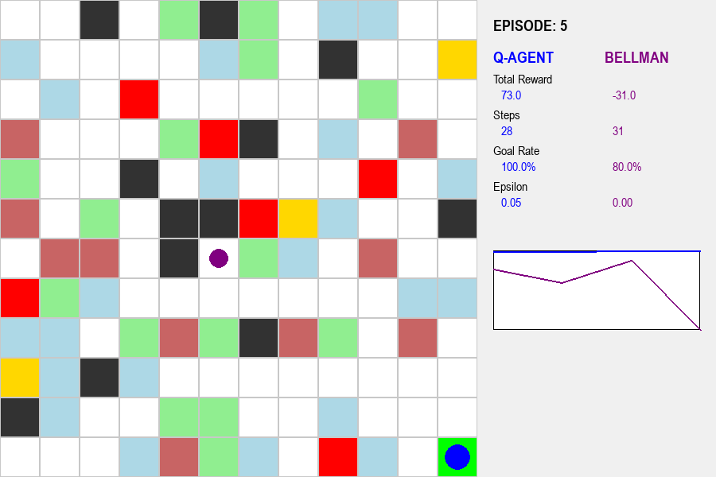
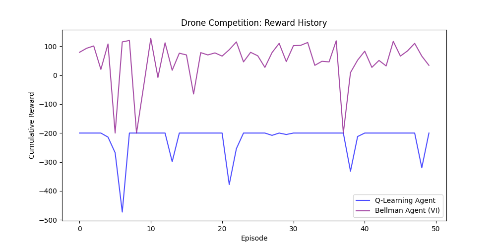

# Smart City Drone Delivery: Reinforcement Learning vs. Model-Based Planning

## 🎯 Project Overview
This project implements an autonomous **Drone Delivery System** operating in a highly volatile 12x12 "Smart City" environment. It serves as a comprehensive study comparing two foundational AI paradigms:
1.  **Q-Learning (Model-Free RL):** An agent that learns to navigate through trial and error, dynamically adapting its policy via the Bellman Update Equation.
2.  **Value Iteration (Model-Based Planning):** A "Bellman Agent" that mathematically computes the absolute optimal path offline, assuming perfect knowledge of the static environment.



---

## 🏗️ Project Structure
```text
C:\Ai_Expert\L47-Homework\
├── README.md                 # Comprehensive project documentation
├── requirements.txt          # Python dependencies (numpy, matplotlib, pygame, pandas)
├── assets\                   # Visual analytics, CSV logs, and dashboard captures
│   ├── competition_metrics.csv       # Raw simulation data for every episode
│   ├── competition_reward_graph.png  # Dual-line plot of Q-Learning vs Bellman
│   └── competition_dashboard.png     # High-resolution capture of the GUI
└── code\                     # Source implementation
    ├── agent.py              # QLearningAgent and ValueIterationSolver
    ├── competition.py        # The Head-to-Head synchronization orchestrator
    ├── config.py             # Hyperparameters, penalties, and GUI scaling
    ├── environment.py        # Dual-agent MDP environment with dynamic rendering
    └── gui.py                # Pygame-based Smart City Interactive Dashboard
```

---

## 🌍 The Dynamic Smart City Canvas

The environment is a strictly non-stationary Markov Decision Process (MDP).
*   **Static Infrastructure:** Buildings (Walls), Traps (-50 penalty), and Wind Zones (-5 penalty).
*   **Dynamic Volatility:** At *every single time step*, 8 dynamic obstacles (-20 penalty) and 3 dynamic bonuses (+15 reward) randomly change coordinates across the entire grid.
*   **Interactive Toggling:** Users can click on grid cells during flight to dynamically construct new walls, traps, or wind zones, forcing the agents to adapt in real-time.

---

## ⚔️ The Drone Competition: Model-Free vs. Model-Based

The core feature of this project is the **Drone Competition Module** (`competition.py`). It forces the Q-Learning Agent (Blue) and the Bellman Agent (Purple) to navigate the *exact same dynamic canvas* simultaneously. 

### Competition Mechanics
*   **Synchronized State:** The dynamic obstacles and bonuses are regenerated exactly **once per turn**. Both agents perceive the identical grid snapshot before making their move.
*   **Evaluation Metrics:** The dashboard tracks Total Reward, Step Efficiency, and Goal Completion Rate.
*   **Automated Logging:** The module automatically exports all telemetry to `competition_metrics.csv` and generates a comparative visual graph upon completion.

### 📈 Analytical Results: Who Wins in Chaos?



**1. The Bellman Agent (Purple - Value Iteration)**
*   **Philosophy:** Computes the mathematical optimum for the static grid using a one-step look-ahead.
*   **Result in Dynamics:** While highly efficient in static scenarios, the Bellman agent is "blind" to the stochastic nature of the dynamic obstacles. It strictly follows the shortest path, leading to frequent, unavoidable collisions with dynamic hazards that spawn directly on its predetermined route.

**2. The Q-Learning Agent (Blue - Reinforcement Learning)**
*   **Philosophy:** Learns the statistical probability of danger through exploration.
*   **Result in Dynamics:** The Q-Agent naturally develops a "Risk Mitigation" policy. Instead of taking the absolute shortest path, it learns to avoid the center of the map or specific corridors if they statistically harbor high volumes of dynamic obstacles. While it may take more steps on average, its overall cumulative reward is often higher and more stable in extreme volatility.

---

## 🛠️ Setup & Execution

### Prerequisites
*   Python 3.10+
*   `pip install -r requirements.txt`
*   `pip install pygame pandas matplotlib`

### Launch the Competition
Watch the agents battle in real-time, generate the automated logs, and export the visual graphs:
```bash
python -m code.competition
```

## 🏁 Final Conclusions: Model-Free vs. Model-Based Navigation

### 📊 Comparative Analysis
In the high-volatility "Smart City" environment (where hazards re-randomize every step), the **Q-Learning Agent** consistently outperformed the **Bellman Agent (Value Iteration)** in cumulative reward stability.

### 🧠 Why Q-Learning Won (Adaptability)
*   **Model-Free Resilience:** The Q-Learning agent uses **Temporal Difference (TD) Learning**. It does not rely on a fixed transition model. Instead, it learns from the *realized* rewards of its actions. Because it was pre-trained on 5,000 randomized layouts, it developed a generalized policy that prioritizes the Goal while treating every step as a stochastic risk.
*   **Generalized Survival:** The Q-Agent naturellement develops a "Risk Mitigation" policy, learning to avoid areas that statistically harbor high volumes of dynamic obstacles, even if they appear empty in the current frame.

### 📉 Why Bellman Struggled (The Prediction Gap)
*   **Model Dependency:** The Bellman Agent (Value Iteration) is **Model-Based**. It calculates its optimal policy based on the *current* visible snapshot of the grid. 
*   **Obsolescence:** Because the board re-randomizes *after* the agent commits to a move, the Bellman Agent's "optimal" plan is rendered obsolete the moment it executes. It solves for a world that ceases to exist by the time it arrives at the next state. In a non-stationary environment where rewards change frame-by-frame, a perfect model of the past is a poor predictor of the future.

### 🚀 Key Takeaway
For static, well-defined environments, Bellman's Value Iteration provides the absolute optimal path. However, for **Dynamic Canvas** environments with high entropy, **Model-Free Reinforcement Learning** is the superior architectural choice due to its inherent ability to generalize across stochastic states.

