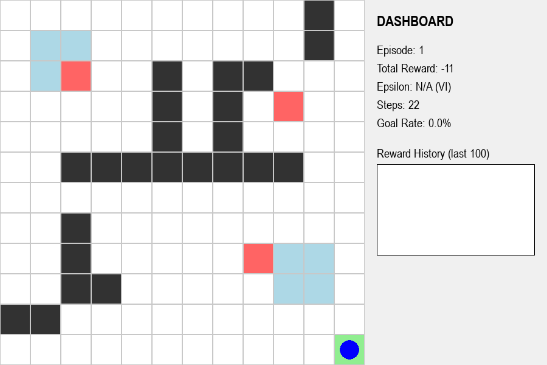

# Smart City Drone Delivery: A Value Iteration Study

## 🎯 Project Overview
This project implements an autonomous **Drone Delivery System** using the **Bellman Equation** and **Value Iteration**. Set in a 12x12 "Smart City" grid, the drone must navigate from a starting warehouse to a delivery goal while optimizing for energy efficiency and avoiding hazards like buildings, wind zones, and traps.

The core objective is to demonstrate **Model-Based Planning** in a Markov Decision Process (MDP), where the agent calculates an mathematically optimal policy offline before executing the flight.



---

## 🏗️ Project Structure
```text
C:\Ai_Expert\L47-Homework\
├── PRD.md                  # Product Requirements Document
├── README.md               # Project documentation and analysis
├── requirements.txt        # Python dependencies (numpy, matplotlib, pygame)
├── assets\                 # Visual performance analysis & simulation results
│   ├── simulation_screenshot.png # High-fidelity GUI with Dashboard
│   ├── value_heatmap.png   # Heatmap of the converged Value Function
│   └── optimal_path.png    # The static optimal trajectory
└── code\                   # Source implementation
    ├── agent.py            # Value Iteration Solver (Bellman Optimality)
    ├── config.py           # City parameters, rewards, & GUI settings
    ├── environment.py      # MDP Model (Transitions & Reward Function)
    ├── gui.py              # Pygame-based Smart City Interface
    └── main.py             # Simulation orchestrator & interactive loop
```

---

## 🧠 The Core Idea: Value Iteration & Bellman Optimality

Unlike model-free reinforcement learning (like Q-Learning), **Value Iteration** assumes the agent has a perfect "map" of the environment's physics (the transition and reward models).

### 📐 Mathematical Foundation

The solver iteratively updates the value of every state $V(s)$ until it converges to the optimal values $V^*(s)$:

$$V_{k+1}(s) \leftarrow \max_{a} \sum_{s'} P(s'|s,a) \left[ R(s,a,s') + \gamma V_k(s') \right]$$

Where:
*   **$V(s)$:** The expected long-term reward from state $s$.
*   **$\gamma$ (Discount Factor):** Set to `0.99` for long-range planning.
*   **$P(s'|s,a)$:** Transition probability (1.0 for deterministic city movement).
*   **$R(s,a,s')$:** The reward received for transitioning from $s$ to $s'$ via action $a$.

Once $V$ converges (max change $< 10^{-6}$), the **Optimal Policy** $\pi^*$ is extracted:
$$\pi^*(s) = \arg\max_{a} \sum_{s'} P(s'|s,a) \left[ R(s,a,s') + \gamma V^*(s') \right]$$

---

## 🌍 Smart City Dynamics

The environment is a multi-zone grid with distinct physical properties:
*   **Buildings (Impassable):** The drone cannot fly through solid structures.
*   **Wind Zones (Turbulence):** High-energy zones that incur a **-2 penalty**.
*   **Trap Zones (Danger):** Dangerous areas to be avoided at all costs (**-5 penalty**).
*   **Empty Sky:** Standard flight path (**-1 step penalty**).
*   **Delivery Goal:** Successful delivery completion (**+10 reward**).

### 🖱️ Interactive Environment
The simulation supports **real-time interaction**. Users can click on any cell to add or remove buildings. The solver immediately re-calculates the optimal policy, and the drone dynamically reroutes its path to account for the new urban landscape.

---

## 📊 Dashboard & Metrics

The right-side dashboard provides real-time telemetry:
*   **Episode:** Current delivery flight count.
*   **Total Reward:** Cumulative energy/reward for the current flight.
*   **Steps:** Number of cells traversed.
*   **Goal Rate:** Rolling success percentage of successful deliveries.
*   **Reward History Graph:** A dynamic line plot showing the performance over the last 100 flights.

---

## 🔬 Technical Comparison: Classical AI (A*) vs. Value Iteration (MDP)

| Feature | A* Search | Value Iteration (Our Method) |
| :--- | :--- | :--- |
| **Logic** | Heuristic-driven search | Bellman Dynamic Programming |
| **Optimality** | Shortest path (Geometric) | Maximum Expected Value (Probabilistic) |
| **Wind/Traps** | Hard to weight properly | Naturally handles varying penalties |
| **Dynamic Changes** | Requires full re-search | Incremental Value Updates |
| **Global Knowledge** | Only calculates path to one goal | Calculates optimal move for *every* cell |

---

## 🛠️ Setup & Usage

### Prerequisites
*   Python 3.10+
*   `pip install -r requirements.txt`
*   `pip install pygame`

### Execution
To launch the interactive Smart City simulation:
```bash
python -m code.main
```

---

## 🚀 Future Roadmap
- [x] **Value Iteration Solver:** Implemented offline planning via the Bellman Equation.
- [x] **Smart City GUI:** Developed a high-fidelity Pygame interface with a dashboard.
- [x] **Interactive Obstacles:** Enabled real-time map editing and dynamic rerouting.
- [ ] **Stochastic Wind:** Introduce a probability factor where wind might blow the drone off course.
- [ ] **Multi-Agent Delivery:** Coordinate multiple drones to avoid mid-air collisions.
- [ ] **Continuous State Space:** Transition from grid-based to vector-based navigation using Deep Reinforcement Learning.
