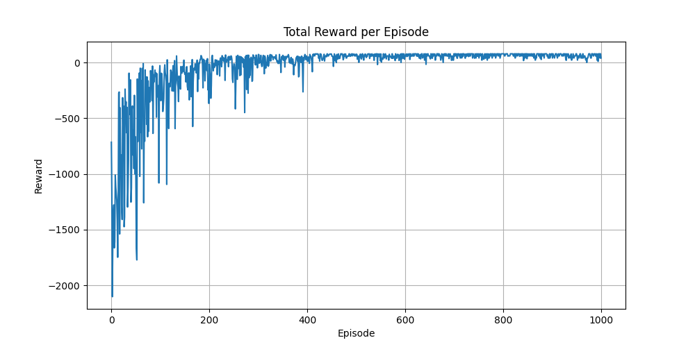
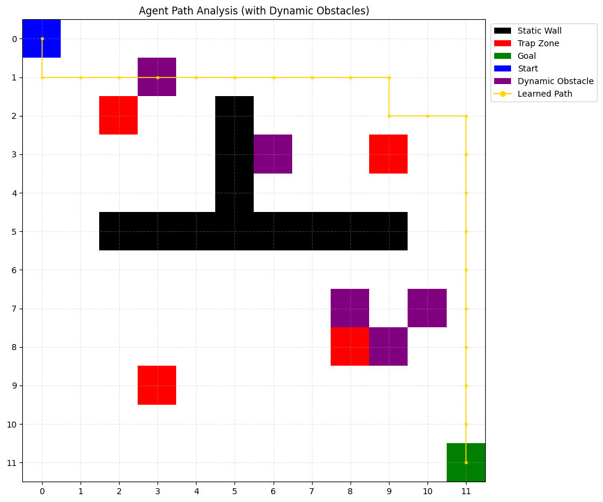

# GridWorld Navigation: A Q-Learning Reinforcement Learning Study

## 🎯 Project Overview
This project implements a **Q-Learning agent** designed to navigate a complex $12 \times 12$ grid environment. The agent must find the optimal path from a starting position $(0, 0)$ to a goal $(11, 11)$ while avoiding static obstacles and high-penalty trap zones. 

The core objective is to demonstrate the efficacy of **Temporal Difference (TD)** learning in discrete state-action spaces, balancing exploration (discovering the environment) and exploitation (using learned knowledge to maximize rewards).

---

## 🏗️ Project Structure
```text
C:\Ai_Expert\L47-Homework\
├── README.md               # Detailed project documentation and analysis
├── requirements.txt        # Python dependencies (numpy, matplotlib)
├── .gitignore              # Git exclusion rules
├── assets\                 # Visual performance analysis & path results
│   ├── final_path.png      # Visualization of the agent's learned trajectory
│   └── training_rewards.png # Cumulative reward trends over training episodes
└── code\                   # Source implementation
    ├── __init__.py         # Package initialization
    ├── agent.py            # Q-Learning Agent implementation (Bellman updates)
    ├── config.py           # Environment parameters, rewards, & hyperparameters
    ├── environment.py      # GridWorld physics and reward logic
    ├── main.py             # Training loop and evaluation execution
    └── visualize.py        # Matplotlib-based plotting utilities
```

---

## 🧠 The Core Idea: Q-Learning & The Bellman Equation

The agent's "brain" is a **Q-Table**, a matrix of size $S \times A$ (where $S$ is the number of states and $A$ is the number of possible actions). Each entry $Q(s, a)$ represents the expected cumulative reward for taking action $a$ in state $s$ and following the optimal policy thereafter.

### 📐 Mathematical Expansion

The learning process is governed by the **Q-Learning update rule**, a specific instance of Temporal Difference learning:

$$Q(s_t, a_t) \leftarrow Q(s_t, a_t) + \alpha \left[ r_{t+1} + \gamma \max_{a} Q(s_{t+1}, a) - Q(s_t, a_t) \right]$$

Where:
*   **$\alpha$ (Learning Rate):** Set to `0.1`, it determines to what extent newly acquired information overrides old information.
*   **$\gamma$ (Discount Factor):** Set to `0.9`, it controls the importance of future rewards. A value of $0.9$ ensures the agent values long-term success over immediate "step" rewards.
*   **$\text{TD Target} = r_{t+1} + \gamma \max_{a} Q(s_{t+1}, a)$:** The current estimation of the state-action value.
*   **$\text{TD Error} = \text{TD Target} - Q(s_t, a_t)$:** The difference between the estimated future reward and the current Q-value.

### 🕹️ Strategy: $\epsilon$-Greedy Exploration
To solve the **Exploration-Exploitation Dilemma**, we employ an exponential $\epsilon$-decay strategy:
$$\epsilon_{t+1} = \max(\epsilon_{min}, \epsilon_t \times \text{decay})$$
*   **Initial $\epsilon$:** $1.0$ (Pure exploration)
*   **Decay Rate:** $0.995$
*   **Min $\epsilon$:** $0.01$ (Residual exploration to ensure robustness)

---

## 🌍 Environment Dynamics

The $12 \times 12$ GridWorld is not a simple walk. It incorporates:
*   **Static Obstacles (Walls):** Horizontal and vertical blocks that force the agent to find non-linear paths.
*   **Dynamic Obstacles (Moving Hazards):** 5 stochastically moving objects that relocate with a $30\%$ probability at each step, challenging the policy's robustness.
*   **Trap Zones:** High-penalty cells $(-50)$ that simulate "dangerous" areas to be avoided.
*   **Step Penalty:** A minor penalty $(-1)$ per movement to incentivize the discovery of the *shortest* path.

| Feature | Coordinate / Value |
| :--- | :--- |
| **Grid Size** | $12 \times 12$ |
| **Start / Goal** | $(0, 0) / (11, 11)$ |
| **Dynamic Obstacles** | 5 (Moving) |
| **Goal Reward** | $+100$ |
| **Trap Penalty** | $-50$ |
| **Dyn. Obs. Penalty** | $-20$ |
| **Step Penalty** | $-1$ |

---

## 📊 Results & Performance Analysis

### 1. Training Convergence (Robustness Test)
The following chart illustrates the agent's learning progress under non-stationary conditions.



**Technical Breakdown:**
*   **Persistent Variance:** Unlike static environments, the reward curve never fully "locks" at a single value. Even after convergence, we see dips (e.g., Episode 1000) where the agent's greedy path was intersected by a dynamic obstacle $(\text{Penalty: } -20)$.
*   **Robustness Factor:** The agent successfully learns a policy that maintains a high average reward $(\approx +60 \text{ to } +80)$ despite the environment's stochastic nature.
*   **Adaptation:** The Q-Learning algorithm effectively "weights" certain transitions lower if they are frequently blocked by moving hazards.

### 2. Path Optimization & Collision Avoidance
This visualization shows the final evaluation trajectory mapped alongside the final positions of dynamic obstacles (purple).



**Strategic Analysis:**
*   **Dynamic Evasion:** The agent has learned to navigate the static wall structure while maintaining enough flexibility to reach the goal even when its "preferred" lane is briefly occupied.
*   **Shortest Path vs. Safety:** The path length is approximately 22-23 steps. The slight deviation from the theoretical minimum is often a learned response to the high probability of dynamic obstacle clusters in certain corridors.

## 🔄 Evolution: Comparative Analysis

The project has evolved from a **Static GridWorld** to a **Dynamic Stochastic Environment**. This transition was designed to test the robustness of the Q-Learning policy and observe how the agent handles non-stationary transitions.

### 📉 Comparative Results: Static vs. Dynamic

| Metric | Static Environment (Baseline) | Dynamic Environment (Robustness Test) |
| :--- | :--- | :--- |
| **Convergence State** | Stable $(\epsilon=0.01)$ | Persistent Fluctuations |
| **Optimal Path Reward** | $\approx +85$ | $\approx +60$ to $+80$ |
| **Policy Nature** | Deterministic Mapping | Probabilistic Risk Mitigation |
| **Learning Complexity** | Low (Fixed Manifolds) | High (Shifting Hazards) |

### 🛠️ Key Architectural Changes
1.  **Stochastic Transitions:** Introduced $P(s'|s, a)$ variance where the environment state $s$ now includes the positions of 5 dynamic obstacles that move with $P=0.3$ per step.
2.  **Penalty Shaping:** Added a specific collision penalty $(-20)$ for dynamic hazards, distinct from the catastrophic Trap penalty $(-50)$.
3.  **Visualization Upgrade:** Expanded the `visualize.py` utility to support multi-class entity rendering (Purple for Dynamic, Red for Traps) with a technical legend.

### 🧪 Technical Insight: Handling Non-Stationarity
In a standard Q-Learning setup, we assume the environment is stationary. By adding moving obstacles, we've introduced **Non-Stationarity**. 
*   **The Challenge:** A state $(r, c)$ that was "safe" in Episode 100 might contain a dynamic obstacle in Episode 101.
*   **Agent Response:** The Q-values for states near high-traffic dynamic areas effectively "sink," representing the expected value over many stochastic realizations. This forces the agent to favor "wide" corridors even if they are slightly longer in Manhattan distance.

---

## 🛠️ Setup & Usage

### Prerequisites
*   Python 3.8+
*   `pip install -r requirements.txt`

### Execution
To train the agent and generate the analysis visualizations:
```bash
python code/main.py
```

---

## 🧐 Honest Assessment & Technical Insights

### ✅ Strengths
*   **Provable Convergence:** In a finite MDP like this GridWorld, Q-learning is guaranteed to converge to the optimal policy given enough exploration.
*   **Efficiency:** The discrete state space allows for rapid training ($1000$ episodes in seconds) without the need for complex neural networks (Deep Q-Learning).

### ⚠️ Limitations & Potential Improvements
*   **State Space Scalability:** A Q-Table grows exponentially with the number of features. For continuous environments (e.g., robotic arms), this approach would suffer from the "Curse of Dimensionality."
*   **Static Environment:** The current agent learns a fixed map. If obstacles moved, the agent would require **Deep Q-Networks (DQN)** or online re-learning.
*   **Next Step:** Implementation of **SARSA** (State-Action-Reward-State-Action) to compare "On-Policy" vs "Off-Policy" behavior, specifically looking at how SARSA's safer approach might avoid traps more conservatively during training.

---

## 🚀 Future Roadmap
- [ ] Implement **DQN** for continuous state space navigation.
- [ ] Compare performance against **A* Search** (Classical AI vs RL).
